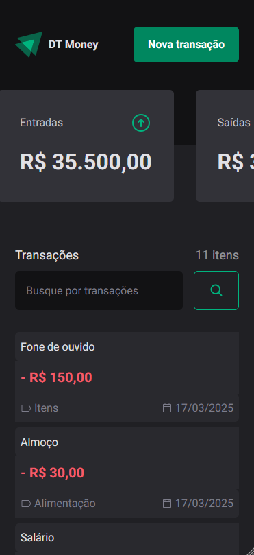
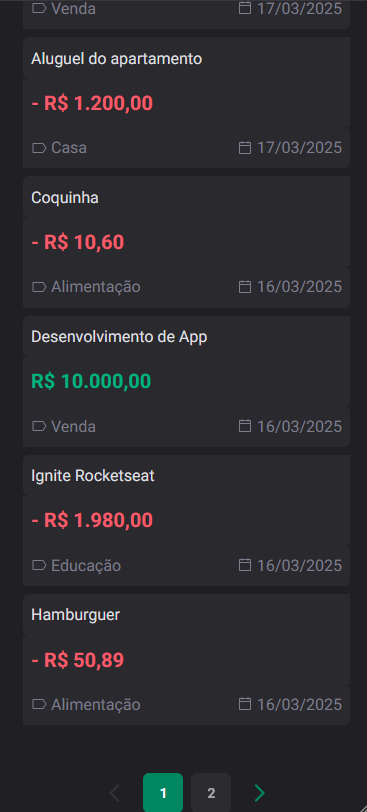

# Ignite DT Money

Personalização:

- Adicionado a versão mobile
  - Botão de busca atualizado
  - Itens das transações atualizado
  - Ícones atualizado
  - Sumário atualizado
- Modal na versão mobile
- Paginação
  - Botão voltar
  - Botão avançar
  - Botões de paginação

Como não usei `Mobile First Development` os ajustes precisaram ser feitos com
mais cuidado MAS, creio que cheguei num layout ok.

<table style="max-width: 800px; margin: 0 auto;">
  <tr>
    <td style="vertical-align: top; padding: 5px 10px;"></td>
    <td style="vertical-align: top; padding: 5px 10px;"></td>
    <td style="vertical-align: top; padding: 5px 10px;"></td>
  </tr>
</table>

Não está perfeito mas está aí a tentativa tá 🆗.